# 🚀 PKL Smartelco 2025

<div align="center">
  
</div>

<div align="center">
  
  
  
  
</div>

---

## 📋 Daftar Isi

- [🎯 Tentang PKL Smartelco 2025](#-tentang-pkl-smartelco-2025)
- [⚡ Quick Start](#-quick-start)
- [📚 Panduan Git Lengkap](#-panduan-git-lengkap)
- [🔄 Workflow Tim](#-workflow-tim)
- [📝 Konvensi Penamaan](#-konvensi-penamaan)
- [🤝 Kontribusi](#-kontribusi)
- [👥 Tim Developer](#-tim-developer)

---

## 🎯 Tentang PKL Smartelco 2025

<div align="center">
  
</div>

Selamat datang di organisasi **PKL Smartelco 2025**! 🎉

Repository ini adalah panduan lengkap untuk semua peserta PKL dalam menggunakan Git dan GitHub untuk kolaborasi proyek. Mari kita belajar bersama dan ciptakan proyek-proyek yang luar biasa!

### 🌟 Tujuan Organisasi
- 📖 Memberikan panduan Git yang mudah dipahami
- 🤝 Memfasilitasi kolaborasi tim yang efektif
- 🚀 Mengembangkan proyek-proyek inovatif
- 💡 Berbagi pengetahuan dan best practices

---

## ⚡ Quick Start

### 1️⃣ Setup Awal

```bash
# Clone repository
git clone https://github.com/PKL-Smartelco-2025/nama-repository.git

# Masuk ke direktori
cd nama-repository

# Setup identitas Git
git config --global user.name "Nama Anda"
git config --global user.email "email@anda.com"
```

### 2️⃣ Alur Kerja Dasar

<div align="center">
  
</div>

```bash
# 1. Pull perubahan terbaru
git pull origin main

# 2. Buat branch baru
git checkout -b feature/nama-fitur

# 3. Lakukan perubahan dan commit
git add .
git commit -m "feat: menambahkan fitur baru"

# 4. Push ke repository
git push origin feature/nama-fitur

# 5. Buat Pull Request di GitHub
```

---

## 📚 Panduan Git Lengkap

### 🔧 **CLONE** - Mengunduh Repository

<details>
<summary>📖 Penjelasan & Contoh</summary>

**Clone** digunakan untuk mengunduh repository dari GitHub ke komputer lokal.

```bash
# Clone dengan HTTPS
git clone https://github.com/PKL-Smartelco-2025/repository-name.git

# Clone dengan SSH
git clone git@github.com:PKL-Smartelco-2025/repository-name.git

# Clone ke folder tertentu
git clone https://github.com/PKL-Smartelco-2025/repository-name.git my-project
```

<div align="center">
  
</div>

</details>

### 📤 **PULL** - Mengambil Perubahan Terbaru

<details>
<summary>📖 Penjelasan & Contoh</summary>

**Pull** digunakan untuk mengambil dan menggabungkan perubahan terbaru dari repository remote.

```bash
# Pull dari branch main
git pull origin main

# Pull dari branch tertentu
git pull origin development

# Pull dengan rebase (lebih bersih)
git pull --rebase origin main

# Melihat perubahan sebelum pull
git fetch
git log HEAD..origin/main --oneline
```

<div align="center">
  
</div>

**⚠️ Tips Penting:**
- Selalu pull sebelum mulai coding
- Resolve conflict jika ada
- Gunakan `git status` untuk melihat status

</details>

### 💾 **ADD & COMMIT** - Menyimpan Perubahan

<details>
<summary>📖 Penjelasan & Contoh</summary>

**Add** untuk menambahkan file ke staging area, **Commit** untuk menyimpan perubahan.

```bash
# Add file tertentu
git add filename.txt

# Add semua file
git add .

# Add dengan pattern
git add *.js

# Commit dengan pesan
git commit -m "feat: menambahkan login functionality"

# Commit semua perubahan tracked files
git commit -am "fix: perbaikan bug pada form validation"

# Commit dengan editor untuk pesan panjang
git commit
```

<div align="center">
  
</div>

**📝 Format Pesan Commit:**
- `feat:` - fitur baru
- `fix:` - perbaikan bug
- `docs:` - dokumentasi
- `style:` - formatting, semicolon
- `refactor:` - refactoring code
- `test:` - menambah testing
- `chore:` - maintenance

</details>

### 🚀 **PUSH** - Mengirim ke Repository

<details>
<summary>📖 Penjelasan & Contoh</summary>

**Push** digunakan untuk mengirim commit lokal ke repository remote.

```bash
# Push ke branch main
git push origin main

# Push branch baru
git push -u origin feature/new-feature

# Push semua branch
git push --all

# Force push (hati-hati!)
git push --force origin main

# Push dengan tags
git push --tags
```

<div align="center">
  
</div>

**⚠️ Perhatian:**
- Pastikan sudah commit sebelum push
- Hindari force push di branch utama
- Check branch yang aktif dengan `git branch`

</details>

### 🌿 **BRANCH** - Manajemen Cabang

<details>
<summary>📖 Penjelasan & Contoh</summary>

**Branch** digunakan untuk membuat cabang pengembangan terpisah.

```bash
# Lihat semua branch
git branch

# Lihat branch remote
git branch -r

# Buat branch baru
git branch feature/user-auth

# Switch ke branch
git checkout feature/user-auth

# Buat dan switch sekaligus
git checkout -b feature/payment-system

# Hapus branch lokal
git branch -d feature/old-feature

# Hapus branch remote
git push origin --delete feature/old-feature
```

<div align="center">
  
</div>

</details>

### 🔄 **MERGE & REBASE** - Menggabungkan Perubahan

<details>
<summary>📖 Penjelasan & Contoh</summary>

**Merge** dan **Rebase** untuk menggabungkan perubahan dari branch lain.

```bash
# Merge branch ke main
git checkout main
git merge feature/user-auth

# Rebase (alternatif merge)
git checkout feature/user-auth
git rebase main

# Interactive rebase
git rebase -i HEAD~3

# Abort merge/rebase jika ada masalah
git merge --abort
git rebase --abort
```

<div align="center">
  
</div>

</details>

### 📊 **STATUS & LOG** - Melihat Informasi

<details>
<summary>📖 Penjelasan & Contoh</summary>

Perintah untuk melihat status dan history repository.

```bash
# Status repository
git status

# History commit
git log

# Log dalam satu baris
git log --oneline

# Log dengan graph
git log --graph --oneline --all

# Log file tertentu
git log -- filename.txt

# Perbedaan file
git diff

# Perbedaan staged files
git diff --staged
```

<div align="center">
  
</div>

</details>

---

## 🔄 Workflow Tim

<div align="center">
  
</div>

### 📋 Alur Kerja Standard

```mermaid
graph LR
    A[📥 Clone/Pull] --> B[🌿 Create Branch]
    B --> C[💻 Code & Commit]
    C --> D[🚀 Push Branch]
    D --> E[🔄 Pull Request]
    E --> F[👀 Code Review]
    F --> G[✅ Merge to Main]
    G --> A
```



### 🎯 Best Practices

<table>
<tr>
<td width="50%">

**✅ DO**
- Selalu pull sebelum coding
- Buat branch untuk setiap fitur
- Commit dengan pesan yang jelas
- Test sebelum push
- Buat PR untuk review

</td>
<td width="50%">

**❌ DON'T**
- Commit langsung ke main
- Push code yang error
- Pesan commit tidak jelas
- Force push tanpa koordinasi
- Skip code review

</td>
</tr>
</table>

---

## 📝 Konvensi Penamaan

### 🌿 Branch Naming

```bash
feature/nama-fitur        # Fitur baru
bugfix/nama-bug          # Perbaikan bug
hotfix/nama-hotfix       # Perbaikan urgent
docs/nama-dokumentasi    # Update dokumentasi
refactor/nama-refactor   # Refactoring code
```

### 💬 Commit Messages

```bash
feat(auth): menambahkan sistem login
fix(api): perbaikan error handling
docs(readme): update installation guide
style(css): perbaikan responsive design
refactor(utils): optimasi helper functions
test(unit): menambahkan test untuk user model
```

---

## 🤝 Kontribusi

### 🚀 Cara Berkontribusi

1. **Fork** repository ini
2. **Clone** ke lokal: `git clone https://github.com/username/repo.git`
3. **Buat branch**: `git checkout -b feature/amazing-feature`
4. **Commit** perubahan: `git commit -m 'feat: add amazing feature'`
5. **Push** ke branch: `git push origin feature/amazing-feature`
6. **Buat Pull Request**

### 📋 Pull Request Template

```markdown
## 📝 Deskripsi
Jelaskan perubahan yang dilakukan

## 🔄 Jenis Perubahan
- [ ] Bug fix
- [ ] New feature
- [ ] Breaking change
- [ ] Documentation update

## ✅ Checklist
- [ ] Code sudah di-test
- [ ] Documentation sudah di-update
- [ ] No breaking changes
```

---

## 👥 Tim Developer

<div align="center">
  
</div>

### 🏆 Contributors

<table>
<tr>
  <td align="center">
    
    <br />
    <sub><b>Nama Developer 1</b></sub>
    <br />
    <sub>Project Lead</sub>
  </td>
  <td align="center">
    
    <br />
    <sub><b>Nama Developer 2</b></sub>
    <br />
    <sub>Frontend Developer</sub>
  </td>
  <td align="center">
    
    <br />
    <sub><b>Nama Developer 3</b></sub>
    <br />
    <sub>Backend Developer</sub>
  </td>
</tr>
</table>

### 📞 Kontak

- 📧 Email: pkl.smartelco2025@gmail.com
- 💬 Discord: [PKL Smartelco 2025](https://discord.gg/pkl-smartelco)
- 📱 WhatsApp: [Group PKL](https://wa.me/group)

---

## 🔗 Resource Tambahan

<div align="center">

[](https://git-scm.com/doc)
[](https://guides.github.com/)
[](https://www.atlassian.com/git/tutorials)

</div>

### 📖 Tutorial Recommend

- [Git Handbook](https://guides.github.com/introduction/git-handbook/)
- [Interactive Git Tutorial](https://learngitbranching.js.org/)
- [Git Cheat Sheet](https://education.github.com/git-cheat-sheet-education.pdf)
- [Oh Shit, Git!](https://ohshitgit.com/) - Solusi masalah Git umum

---

<div align="center">
  
</div>

<div align="center">

**Made with ❤️ by PKL Smartelco 2025 Team**

⭐ Star this repo if it's helpful! | 🍴 Fork to contribute | 📢 Share with your team

</div>

---
 
